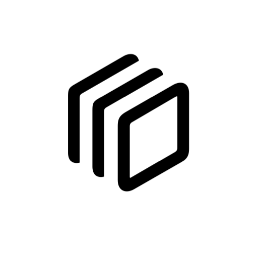

# Klyp

**A native macOS clipboard manager that lives in your menu bar.**

Klyp quietly watches the system pasteboard, keeps a searchable history of everything you copy, and puts any item back with one click. Text, rich text, links, colors, images, and files — all supported. No account, no cloud, no browser extension.

<p align="center">
  
</p>

<p align="center"><sub>App icon — <code>square.stack.3d.down.right</code> on a white squircle</sub></p>

## Download

Grab the latest **`Klyp-1.0.1.dmg`** from [Releases](https://github.com/khamdokhov/klyp/releases/latest), open it, and drag **Klyp** into **Applications**.

> **First launch (unsigned build):** macOS may block the app. Right-click **Klyp → Open**, or go to **System Settings → Privacy & Security → Open Anyway**. You only need to do this once.

Prefer building yourself? See [Build from source](#build-from-source) below.

## Features

- **Menu bar presence** — lives out of the way; opens with a click or global shortcut (default **⇧⌘V**)
- **Full clipboard coverage** — text, RTF/HTML, URLs, colors, images, and file references
- **Instant search** — filter by preview text, source app, or content type
- **Keyboard-first** — arrow keys, **Return** to paste back, **⌘F** for search, **Esc** to close
- **Pin favorites** — pinned clips survive history limits
- **Privacy by default** — password-manager clips and auto-generated content are skipped unless you opt in
- **Optional auto-paste** — paste straight into the previous app via synthesized **⌘V** (needs Accessibility)
- **Launch at login** — wired to macOS Login Items (reflects real system state)

## Quick start

1. Install and open Klyp. A stack icon appears in the menu bar.
2. Copy as usual. New clips are captured in the background.
3. Press **⇧⌘V** or click the icon to open history.
4. Pick an item — it returns to the clipboard. Paste with **⌘V**, or enable auto-paste in Settings.

## Permissions

| Permission | When | Why |
|---|---|---|
| Clipboard | Always | Core feature — reads the general pasteboard to build history |
| Accessibility | Auto-paste only | Sends **⌘V** to the previously active app |
| Login Item | Optional | Start at login |

Copy-back alone does **not** require Accessibility. If you rebuild the app locally, you may need to re-grant Accessibility and the global hotkey — macOS ties those to the app identity.

## Privacy

- **Concealed** clips (password managers) — not stored unless you enable it
- **Auto-generated** clips — off by default
- **Transient** clips — always ignored (honors the pasteboard contract)
- Optional secure storage uses the **Keychain**, not plain files

## Build from source

**Requirements:** macOS 14+, Xcode 16+

```bash
git clone git@github.com:khamdokhov/klyp.git
cd klyp
open Klyp.xcodeproj
```

Run the **Klyp** scheme (**⌘R**). The project uses automatic *Sign to Run Locally* — no Apple Developer account needed.

### Command line

```bash
xcodebuild -scheme Klyp -configuration Release -destination 'platform=macOS' build
```

### Tests

```bash
xcodebuild test -scheme Klyp -destination 'platform=macOS' -derivedDataPath build/DerivedData
```

### Package a DMG

```bash
./scripts/make-dmg.sh
# → dist/Klyp-1.0.1.dmg
```

### Regenerate the app icon

Icons are generated from the same SF Symbol as the menu bar (`square.stack.3d.down.right`) on a **white** squircle background:

```bash
cat Tools/AppSymbol.swift Tools/GenerateAppIcon/main.swift | swift -
```

## Project structure

```
Klyp/           Application source
KlypTests/      Unit tests
Tools/            App icon generator
scripts/          Release helpers (DMG)
```

## Tech

- Swift, SwiftUI + AppKit
- macOS 14 minimum
- Zero external dependencies
- Carbon global hotkey, local JSON + file storage, Keychain for secrets

## License

MIT — see [LICENSE](LICENSE).
